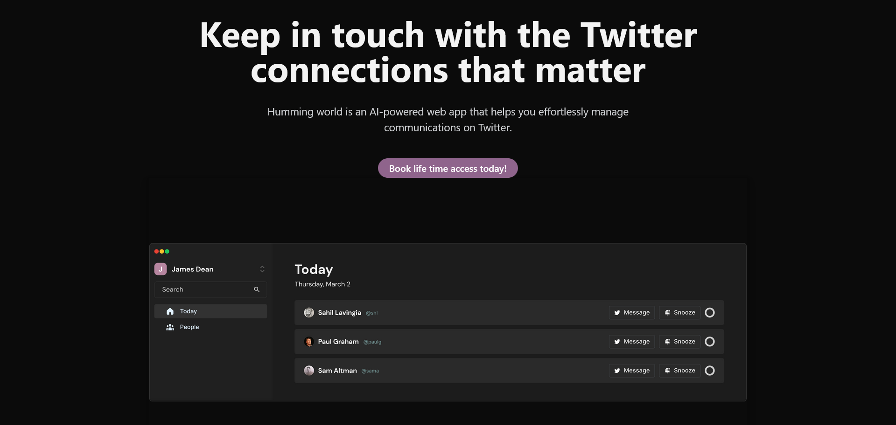

# Humming World

Humming World was a app for managing your Twitter connections. Think of it as your personal assistant for all things Twitter, which pings you when you are losing touch with your connection.

## Algorithm for Network Strength Score

Laying the foundation for algorithm
### Score Calculation

Score can be calculated using the following parameters:

- DM → +3
- Tweet Parameters
    - Like → +1
    - Comment → +3
    - Mention → +2
    - Re-tweet → +1

The score can be changed according to requirements. The higher the score, the more user is not in touch with its connections

### Greedy Algorithm

1. Fetch the followers and followings of the target user
2. Filter out only those which have bidirectional relationship with target user i.e. both are following and followers of each other
3. Store the filtered user list in variable **combined**
4. Set the inactivity **threshold**: 14 days or 2 weeks. It can be set according to what you consider a reach-out period
5. Loop through the target users DMs
	1. Check if the user is present in **combined**
	2. If **true** 
		1. Query the most recent message timestamp
		2. If the timestamp comes out to be less than or equals to the threshold value then no need to reach out
		3. Remove it from combined
	3. Else
		1. Update the score in **combined**
6. Now query the Tweets' data of the target user about **threshold** days
7. Collect all the users from Tweets' data with *tweet parameter* property
	1. Check if the *tweet parameters* match any user in **combined**
	2. Update the score based on *tweet parameter*
8. Finally we have a **Reconnect Score** for people in **combined**
9. The reminder will be send based on the highest **Reconnect Score** in ascending order.

Surely there will be some edge cases, improvements and gotchas in the propose algorithm.

---

If you want to read more about Humming World, then here's a [post](https://prashikmeshram.com/project/humming-world) where I have highlighted why it's archived, the challenges and some remaining part of the story.